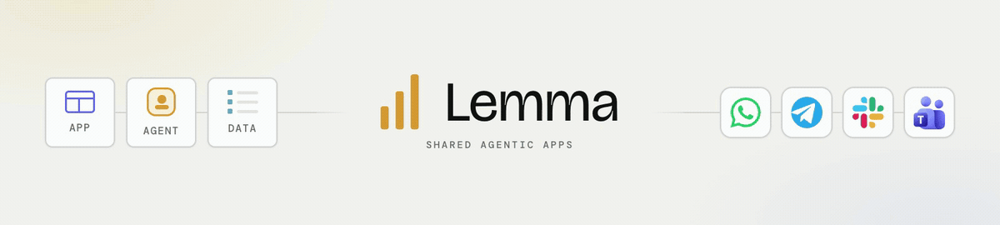
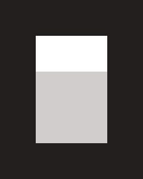
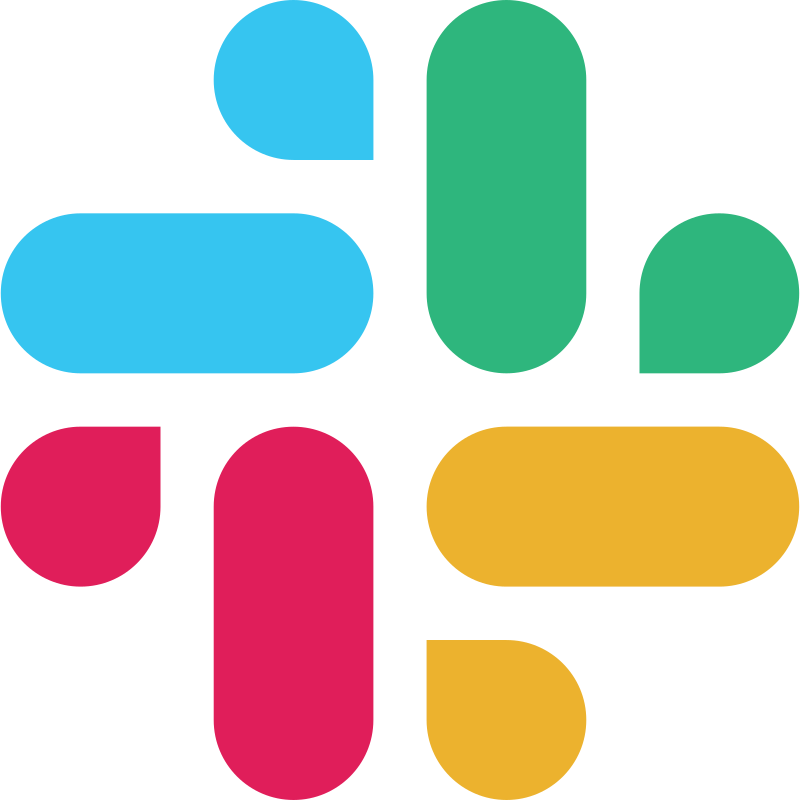
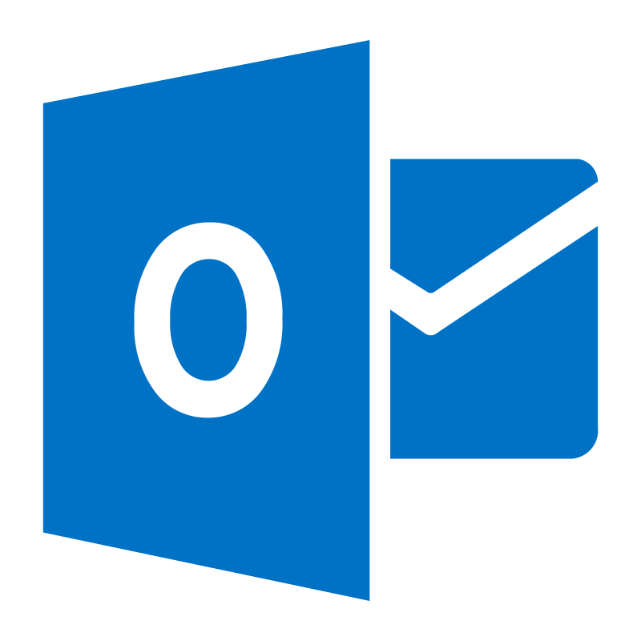

<div align="center">



**Give every recurring job its own agentic app.**


<a href="https://github.com/lemma-work/lemma-platform/releases/latest"></a>

[Quickstart](#quickstart) · [Why an app](#why-an-app-not-another-chat) · [Inside a pod](#inside-a-pod) · [Surfaces](#chat-is-a-door-not-the-building) · [Coding agents](#build-and-operate-with-the-coding-agent-you-already-have) · [Docs](https://lemma.work/docs)

Website → **[lemma.work](https://lemma.work)**

</div>

---

A **Telegram bot** that tracks your expenses. A **research room** where agents gather sources, compare findings, and challenge each other's claims. A **support desk** where agents triage requests in the background and people step in for decisions.

These jobs have different things to remember, different actions to take, and different ways people need to see the work. A blank chat box gives all of them the same empty interface. Lemma gives each job its own app — and gives the agents inside it the memory, tools, routines, and boundaries they need to keep it running.

**Open source. Runs locally. Use Claude Code or Codex through your existing subscription, Lemma-managed models, or any OpenAI-compatible or Anthropic-compatible provider. Run it on your laptop, your server, or Lemma Cloud.**

<div align="center">

**Build and operate Lemma apps with the coding agent you already use.**

<table>
  <tr>
    <td align="center"><br><sub>Claude Code</sub></td>
    <td align="center"><br><sub>Codex</sub></td>
    <td align="center"><br><sub>OpenCode</sub></td>
    <td align="center"><br><sub>Cursor</sub></td>
    <td align="center"><br><sub>Antigravity</sub></td>
  </tr>
</table>

<em>The same agent authors the app, data, agents, workflows, and permissions — then verifies the result.</em>

</div>

## Quickstart

### Download the Mac app

<a href="https://github.com/lemma-work/lemma-platform/releases/latest"></a>

The signed and notarized Mac app is the shortest path on Apple silicon (M1 or newer). Open the latest release, download the `.dmg`, and run Lemma locally.

### Run locally

One command brings the full stack up, self-contained. It uses Docker or Podman and can install Podman for you.

**macOS / Linux:**

```bash
curl -fsSL https://raw.githubusercontent.com/lemma-work/lemma-platform/main/install.sh | bash
```

**Windows** (PowerShell, Docker Desktop required):

```powershell
iwr https://raw.githubusercontent.com/lemma-work/lemma-platform/main/install.ps1 | iex
```

The installer opens Lemma at `http://127-0-0-1.sslip.io:3711`. Use that exact host rather than `localhost`; authentication is scoped to it. Manage the installation with `lemma-stack start|stop|status|logs|config|uninstall`.

Install the CLI, point it at the local stack, and give your coding agent Lemma's skills:

```bash
uv tool install lemma-terminal
lemma servers select local
lemma auth login
lemma skills install
lemma pod create my-team --with-starter
```

Open the generated `my-team/` directory in Claude Code, Codex, OpenCode, Cursor, or Antigravity and ask it to build the app you want. Antigravity users should first run `lemma skills install --target agents --scope project` from inside that directory. The coding agent authors and verifies the pod through the same CLI.

To let the pod dispatch runs through your local Claude Code, Codex, OpenCode, Cursor, or Antigravity login, start the daemon:

```bash
lemma daemon start --background
lemma daemon status
```

<details>
<summary>Configure a provider for server-run agents and conversations</summary>

Provider settings live under `[backend.env]` in `~/.lemma/local/config.toml`:

```bash
lemma-stack config set LEMMA_DEFAULT_MODEL_TYPE anthropic_compat
lemma-stack config set LEMMA_ANTHROPIC_API_KEY sk-ant-...
# Or use openai_compat with LEMMA_OPENAI_API_KEY and an optional compatible base URL.
lemma-stack restart
```

See [installation](docs/installation.md#configure) for every provider and connector setting.

</details>

### Use Lemma Cloud

Sign up at [lemma.work](https://lemma.work) when you want the same stack hosted and reachable by teammates and surfaces without running it yourself:

```bash
uv tool install lemma-terminal
lemma servers select lemma-cloud
lemma auth login
lemma skills install
lemma pod create my-team --with-starter   # scaffolds a working starter (table + agent) and imports it
lemma chat "what can you do in this pod?"
```

## Why an app, not another chat

A capable model in a blank box still doesn't know what it's responsible for, what happened yesterday, what's true right now, what it may do alone, or who to ask when it shouldn't act. The agentic app is the harness that gives the model a job and a place to do it:

| The agent needs | The agentic app includes |
|---|---|
| **A job** | A role, instructions, and a queue. Work is assigned to the agent, not pasted at it. |
| **Memory** | Files, playbooks, decisions, and history that persist between runs. |
| **Current state** | Typed tables and records shared with people and other agents through the same APIs. |
| **Tools** | Functions, connectors, APIs, and other agents. |
| **Routines** | Workflows, schedules, triggers, waits, and loops. |
| **Boundaries** | Permissions and grants scoped to specific resources and actions. |
| **Human judgment** | Forms and approvals that pause the work and resume it after a decision. |
| **A place to work** | An app UI and connected surfaces over the same state. |

People and agents work against the same state from different interfaces: app views and approval queues for people, APIs and the CLI for agents, and Slack, email, Telegram, or WhatsApp when those are the best entry points.

## The app gets better instead of the chat getting longer

In a chat tool, day thirty looks exactly like day one: a blank box. In a Lemma app, work leaves structure behind. A triaged email becomes a record. You save repeated corrections as standing instructions, promote repeated sequences to workflows, and encode recurring judgment in agent roles — with approval gates wherever people stay responsible.

A pod exports as portable files: tables, agents, workflows, permissions, apps, and the rest of the system. The same coding agent that built it can export, change, verify, and re-import it. Remix it, share it, or start from one somebody else built:

```bash
lemma pod export ./support-desk    # the whole system, as files
lemma pod import ./support-desk    # ship it back — or to another machine
```

## Inside a pod

Everything in Lemma lives in a **pod** — a self-contained environment for one person, team, or process. A pod holds shared state, agents, workflows, permissions, and one or more apps.

| Primitive | What it gives you |
|---|---|
| **Tables** | Typed, queryable business data with row-level security. Leads, tickets, tasks, approvals — readable by agents, owned by the pod. |
| **Files** | Markdown memory for everything structure can't capture — preferences, playbooks, voice guides, notes. Full-text searchable, permission-scoped, read and written by agents alongside the tables. |
| **Agents** | LLM workers with a role, tool grants, and scoped access to specific tables, files, and connectors — never vague access to everything. |
| **Workflows** | Graphs that mix agents, functions, decisions, loops, waits, and **human approval steps**. Triggered by schedules, webhooks, table events, chat, or the API. |
| **Functions** | Deterministic logic alongside the agents — validators, transitions, actions. Not everything should be LLM reasoning. |
| **Permissions** | Roles for people *and* agents: pod-level roles, table grants, resource visibility, delegation tokens. |
| **Approvals** | Workflow steps that pause, route to a specific person, and resume on their decision — in the app or in Slack. |
| **Apps** | The operator UI your team works from, deployed at a URL, built on the same pod APIs — a single-file HTML page (no build) or a full React app. |
| **Surfaces** | Slack, Microsoft Teams, Gmail, Outlook, Telegram, and WhatsApp — wired to pod agents with identity resolution and conversation linking. |

## Chat is a door, not the building

A teammate approves a refund **in Slack**. A field update arrives as a **WhatsApp** voice note and lands as a structured record. An agent drafts a customer reply **in Gmail** and waits for a human before sending. The conversation is the surface — underneath, all of it reads and writes the same tables, runs through the same workflows, and respects the same permissions.

Supported today: **Slack, Microsoft Teams, Gmail, Outlook, Telegram, WhatsApp** — each with webhook ingress, identity resolution, and agent-initiated actions. Telegram long-polling and Slack Socket Mode are built in, so local setups work without a public webhook URL.

<div align="center">

<table>
  <tr>
    <td align="center"><strong>Surfaces</strong></td>
    <td align="center"><br><sub>Slack</sub></td>
    <td align="center"><br><sub>Teams</sub></td>
    <td align="center"><br><sub>Gmail</sub></td>
    <td align="center"><br><sub>Outlook</sub></td>
    <td align="center"><br><sub>Telegram</sub></td>
    <td align="center"><br><sub>WhatsApp</sub></td>
  </tr>
</table>

<em>Wherever your team already works, the pod shows up.</em>

</div>

This isn't only for teams. A pod of one human and a few agents — with WhatsApp as the front door and tables as the memory — is a personal assistant that keeps state, asks before it acts, and picks up tomorrow where it left off today.

## Build and operate with the coding agent you already have

A pod can be exported as plain files, so building one is a job a coding agent is already good at: describe the system, let the agent author the bundle, and import it. The agent that builds it also tests it by creating records, running workflows, and chatting with the agents it defined. Building and operating use the same CLI.

**Install Lemma's skills into the agent you already use** — Claude Code, Codex, OpenCode, or Cursor:

```bash
lemma skills install             # auto-detects Claude Code / Codex / OpenCode / Cursor
lemma skills install --target claude --all-skills   # or pick a target and include extras
lemma skills install --target agents --scope project # Antigravity, from inside the pod directory
```

Skills ship in [`lemma-skills/`](lemma-skills/). Restart your coding agent after installing, then ask it to build a pod:

```bash
lemma pod init my-team           # scaffold a starter bundle to edit (or: lemma agent|table|workflow init …)
lemma pod import ./the-pod-your-agent-wrote
lemma apps deploy my-app ./index.html   # deploy a no-build HTML app (or a Vite project dir)
```

**Or run your agent inside Lemma.** `lemma daemon start` connects your local Claude Code, Codex, OpenCode, Cursor, or Antigravity to the pod: it picks up tasks from a shared queue, streams its work back through the pod, and gets stopped by the same approvals as everyone else. Two agents working the same pod see the same state — a task queue, not a terminal session that evaporates.

```bash
lemma daemon start --background  # your local agent serves pod-assigned runs
lemma daemon status              # pid, running state, log path
lemma daemon stop
```

Any agent operates a pod directly through the CLI:

```bash
lemma table list                 # inspect the data model
lemma record update tasks rec_8f2k --data '{"status": "done"}'
lemma agent run qualifier --input '{"lead_id": "..."}'
lemma workflow start follow-up   # pauses at human approval steps
lemma chat "what's left in the queue?"
```

If you're reading this inside a coding agent session: that agent can work a pod right now.

Python and TypeScript SDKs (with 25+ React hooks) live in [`lemma-python/`](lemma-python/) and [`lemma-typescript/`](lemma-typescript/). Generating your frontend elsewhere? Back it with a pod — the TypeScript SDK gives any app tables, agents, workflows, and permissions out of the box.

## Local-first, no lock-in

- **Your machine.** The full stack runs self-contained on your laptop. Your data never leaves unless you wire it somewhere.
- **Our cloud, when you want it.** [lemma.work](https://lemma.work) runs the same open-source stack — for when you want your pod reachable by teammates and surfaces without hosting anything.
- **Your subscription, managed models, or your keys.** Pod-assigned runs use your local **Claude Code or Codex login** through the daemon. Server-run agents use Lemma-managed models or an **Anthropic-compatible or OpenAI-compatible** key or endpoint — a cloud provider, a self-hosted gateway, or a local model. Runtime profiles are per pod, so different agents can use different models.
- **Your code.** Core is [AGPLv3](LICENSE); SDKs, CLI, and tools are [Apache-2.0](LICENSES/Apache-2.0.txt).

## Repo layout

| Path | Package | License |
|------|---------|---------|
| `lemma-backend/` | FastAPI backend, migrations, and infra Docker Compose | AGPLv3 |
| `lemma-frontend/` | Next.js frontend | AGPLv3 |
| `agentbox/` | Sandboxed agent workspace manager and runtime image | Apache-2.0 |
| `agentbox-client/` | Python client for the AgentBox workspace API | Apache-2.0 |
| `lemma-stack/` | `lemma-stack` — installer and manager for a self-contained local stack | Apache-2.0 |
| `desktop/` | Tauri macOS desktop app (thin shell around the `lemma-stack` supervisor) | AGPLv3 |
| `lemma-cli/` | `lemma-terminal` — the `lemma` CLI and terminal UI | Apache-2.0 |
| `lemma-python/` | `lemma-sdk` — Python SDK | Apache-2.0 |
| `lemma-typescript/` | `lemma-sdk` — TypeScript/JavaScript SDK for Node, browser, and React | Apache-2.0 |
| `lemma-skills/` | Built-in agent skills | Apache-2.0 |
| `docs/` | Installation and setup guides | — |
| `install.sh` | One-line bootstrap installer | — |

No git submodules — everything is a normal directory in one repo.

## Development

For contributing to the platform itself — hot-reload from source:

```bash
git clone https://github.com/lemma-work/lemma-platform.git
cd lemma-platform
make dev         # run backend, frontend, agentbox with live reload
make logs        # tail backend logs
make stop        # stop dev app processes
make stop-all    # also stop dev infra
```

Run `make help` for the full list. The dev stack runs on its own ports
(frontend 3710, backend 8710) so it never collides with an installed
`lemma-stack` stack (3711/8711).

Backend-only commands live in `lemma-backend/`:

```bash
cd lemma-backend
make test
make lint
make migrate
```

See [`docs/installation.md`](docs/installation.md) for the full setup guide,
[`lemma-backend/README.md`](lemma-backend/README.md) for backend details, and
[`lemma-frontend/README.md`](lemma-frontend/README.md) for frontend details.

## Licensing

The Lemma platform uses a dual-licensing model:

**AGPLv3** (server-delivered core):

- `lemma-backend/` — the FastAPI backend
- `lemma-frontend/` — the Next.js frontend and operator UI

These are licensed under the [GNU Affero General Public License v3](LICENSE).
If you modify and offer the software over a network (e.g. a hosted SaaS), you
must release your modified source under the same terms.

**Apache-2.0** (client-side developer tools):

- `agentbox/` — sandboxed agent workspace manager and runtime image
- `agentbox-client/` — Python client for the AgentBox workspace API
- `lemma-stack/` — local stack installer and manager
- `lemma-cli/` — the `lemma` CLI and terminal UI
- `lemma-python/` — the Python SDK
- `lemma-typescript/` — the TypeScript SDK
- `lemma-skills/` — agent skills

These are intended for broad embedding, installation, and adaptation, so they
remain Apache-2.0 and include their own `LICENSE` files.

**Commercial licensing and exceptions** are available from Lemma for
organizations whose procurement policies do not accommodate AGPLv3. The
commercial exception neutralizes the AGPL procurement friction while keeping the
core genuinely open source.

**Trademark:** The Lemma name, logos, and marks are trademarks of Lemma and are
not granted by the software licenses. Fork the code, not the brand.
