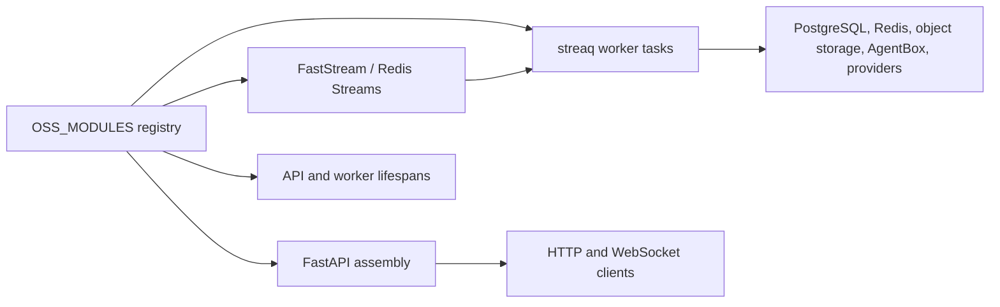
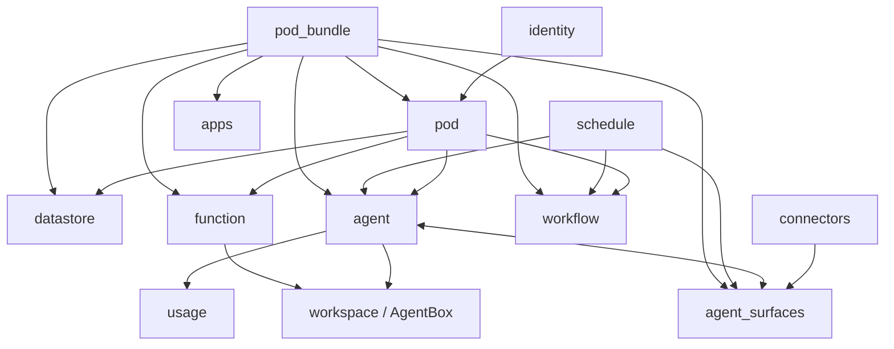

# Lemma backend module guide

This directory describes the 14 open-source runtime modules registered in
`app/core/registry/installed.py`. A module document explains the behavior that
exists today; it is not a product roadmap. Review findings and proposed work
live separately in [issues.md](issues.md).

## How modules are assembled

Each `app/modules/<name>/module.py` exposes a lazy `LemmaModule` declaration.
The declaration may contribute FastAPI routers, Redis Stream consumers, streaq
tasks, and API/worker lifespan hooks. `app.app.create_app()` mounts the API
contributions; `app.events` and the worker runtime wire background work.

The canonical registration order is identity, pod, pod bundle, datastore,
schedule, connectors, agent, function, apps, workflow, agent surfaces, icon,
usage, and workspace. Order affects router and lifespan registration, but
modules should communicate through explicit ports or domain events rather than
depending on import order.

## Module catalog

| Module | Primary responsibility | Durable tables owned |
| --- | --- | --- |
| [identity](identity.md) | Users, organizations, invitations, authentication | `users`, `organizations`, `organization_members`, `organization_invitations` |
| [pod](pod.md) | Workspace tenancy, membership, roles, resource grants | `pods`, `pod_members`, `pod_join_requests`; shared authorization grant tables live in core |
| [pod_bundle](pod_bundle.md) | Export, plan, import, and GitHub publish of portable pods | None; active job state is ephemeral in Redis |
| [datastore](datastore.md) | Dynamic tables/records, files, search, document processing | `datastore_tables`, `datastore_files`, per-pod PostgreSQL schemas |
| [schedule](schedule.md) | Time, webhook, datastore, and application triggers | `schedules`; APScheduler also has its own job store |
| [connectors](connectors.md) | Connector catalog, auth configs, accounts, operations, triggers | `connectors`, `auth_configs`, `accounts`, `connect_requests`, `connector_operations`, `connector_triggers` |
| [agent](agent.md) | Agents, conversations, runs, tools, runtimes, approvals, widgets | `agents`, `agent_runtime_profiles`, `agent_runtime_daemons`, `agent_conversations`, `agent_runs`, `agent_messages`, `agent_approval_decisions`, `agent_feedback` |
| [function](function.md) | Versioned deterministic function definitions and sandboxed runs | `functions`, `function_runs` |
| [apps](apps.md) | Pod app metadata, source/dist releases, and public asset hosting | `apps`, `app_releases` |
| [workflow](workflow.md) | Workflow graphs, execution, waits, forms, and resumptions | `workflow_flows`, `workflow_flow_runs`, `workflow_run_waits` |
| [agent_surfaces](agent_surfaces.md) | External chat/email ingress, identity mapping, and delivery | `agent_surfaces`, `agent_surface_external_users`, `agent_surface_conversation_links` |
| [icon](icon.md) | Public raster icon upload and retrieval | None; bytes live in public object/local storage |
| [usage](usage.md) | Model-usage metering, reservations, limits, and reporting | `usage_records`, `usage_limit_counters` |
| [workspace](workspace.md) | AgentBox sandbox/session access and workspace tool runtime | None; runtime state is in AgentBox and Redis |

## Cross-module runtime map

The arrows show runtime use, not desired ownership. Several current imports
cross infrastructure and service boundaries; that design debt is tracked in
[issues.md](issues.md#arch-001--module-boundaries-contain-multiple-import-cycles).

## Shared invariants

- Authentication is global, with a small set of explicitly public routes.
- Pod-scoped work is authorized with a `Context`; delegated workloads receive
  only grants/scopes encoded for that workload.
- A database unit of work must not stay open across model, provider, sandbox,
  object-storage, streaming, or retry I/O.
- Durable writes and background side effects must be idempotent because Redis
  Streams and streaq are at-least-once systems.
- API errors use the shared `{message, code, details}` envelope.
- Secrets should be encrypted at rest and must never be logged or returned in
  diagnostic details.

## Verification snapshot

Reviewed on 2026-07-09. `make test-unit`/`make coverage-backend-unit` ran 2,007
tests: 2,006 passed and one optional `markitdown` test skipped. Current unit
line coverage is 63.9% overall. The async-safety Ruff gate passes; full Ruff on
production module code reports 31 findings and is not the CI gate. These facts
are evidence for the issue register, not promises that all integration paths
were executed.
