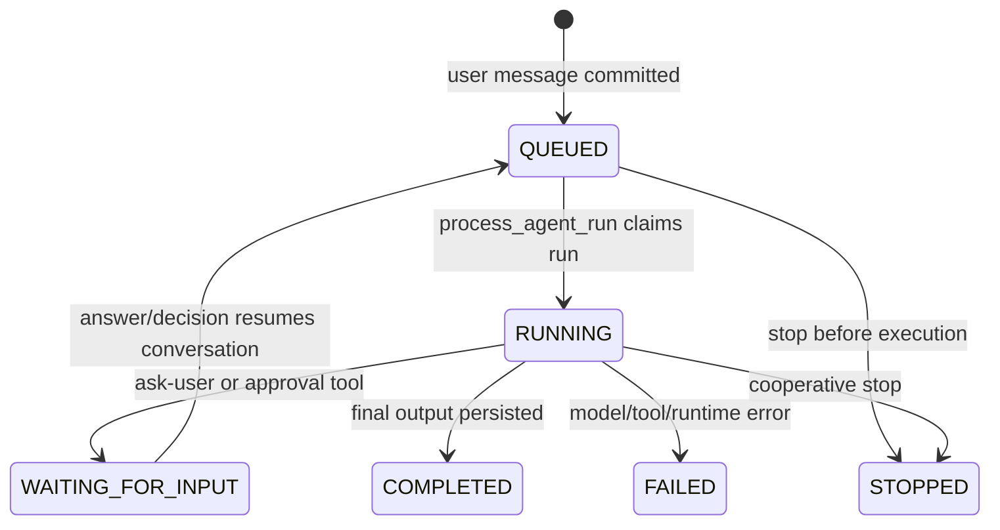

# Agent module

## Purpose

`app/modules/agent` owns agent definitions, conversations/messages, model runs,
runtime profiles, local daemon connections, tool assembly, approvals, realtime
streaming, MCP access, widgets, and usage handoff. It is the central execution
module; external delivery belongs to [agent surfaces](agent_surfaces.md), and
sandbox lifecycle belongs to [workspace](workspace.md).

## Runtime contributions

| Contribution | Behavior |
| --- | --- |
| API routers | Agent CRUD/permissions, conversations/messages/SSE, runtime profiles/daemon WebSocket, tools, widgets |
| Redis consumer | Converts agent lifecycle events into queued work and title generation |
| streaq tasks | Run agents, generate titles, reconcile orphaned runs |
| Published stream | `agent_events` |
| Mounted MCP apps | Conversation and pod tool servers are assembled by the backend root using agent services |

Durable lifecycle events are staged in the PostgreSQL outbox and reach Redis
Streams only through the core message bus. Transient token/status frames use the
core realtime-channel port with a Redis Pub/Sub adapter; each SSE connection
leases one subscription connection and releases it on completion, failure, or
cancellation.

## Main data model

| Table | Meaning |
| --- | --- |
| `agents` | Named prompt, schemas, toolsets, runtime selection, visibility |
| `agent_runtime_profiles` | Organization/user/system model provider configuration and encrypted credentials |
| `agent_runtime_daemons` | Presence/capability state for local Codex/Claude/OpenCode daemons |
| `agent_conversations` | Pod thread, named/default agent, parent/subagent and workspace metadata |
| `agent_messages` | User/assistant/tool messages and structured parts |
| `agent_runs` | One execution attempt, status, usage, errors, stop state, harness metadata |
| `agent_approval_decisions`, `agent_feedback` | Durable interaction/audit records |

## API groups

| Routes | What they do |
| --- | --- |
| `/pods/{pod_id}/agents` | Agent CRUD plus resource permission replacement |
| `/pods/{pod_id}/conversations` | Create/list/read/update, messages, approvals, send, stream, stop |
| `/organizations/{org}/agent-runtime/profiles` | Discover/create model runtime profiles |
| `/agent-runtime/harnesses`, `/me/agent-runtime/daemon/ws` | Harness catalog and local daemon transport |
| `/tools/*` | Server-side web search and feedback endpoints used by runtimes |
| `/widgets/serve...`, `/pods/{pod}/widgets...` | Render/submit a tool widget and mint an authenticated embed URL |

## Run lifecycle

The runner resolves a runtime profile and harness (`pydantic_ai`, local daemon,
or test harness), builds only the allowed toolsets, creates short UoWs for
message/status transitions, performs model/tool I/O outside them, publishes
realtime frames, and records usage. Tool calls receive a delegated workload
context; destructive operations require a standing grant or session approval.
Daemon listener tasks are cancelled before their Redis clients close, and a
superseded websocket cannot unregister its replacement connection.

Subagents are child conversations with inherited workspace context and reduced
toolsets. Widgets are tool outputs stored in conversation context and served
through signed, purpose-bound embed access.

## Key dependencies

- Pod/identity: tenant, membership, authorization, delegation.
- Datastore/connectors/function: agent-callable resources.
- Workspace: shell, Python, browser, file, and long-lived process sessions.
- Usage: reserve and record model cost.
- Agent surfaces: surface context and platform tools; this dependency is
  currently bidirectional.

## Tests and operations

The test suite covers tool assembly, messages, approvals, cancellation,
runtime profiles, daemon reconnection, MCP, widgets, usage, subagents, and
mocked/real harness paths. Current unit coverage is 63.2% (5,339 of 8,444
statements). Large orchestration classes and cross-module coupling are tracked
in [issues.md](issues.md).
