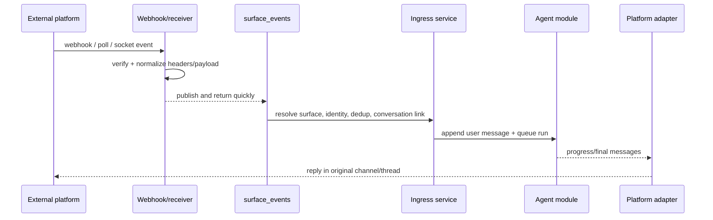

# Agent surfaces module

## Purpose

`app/modules/agent_surfaces` connects external messaging/email platforms to
pod-scoped agent conversations. It owns surface configuration, webhook/native
receiver ingress, signature verification, event normalization, external-user
identity resolution, thread-to-conversation links, attachment ingestion,
platform tools, progress rendering, and outbound delivery.

Supported adapters currently include Slack, Microsoft Teams, Telegram,
WhatsApp, Gmail, Outlook, and Resend-backed email behavior.

## Runtime contributions

| Contribution | Behavior |
| --- | --- |
| API routers | Pod surface CRUD/setup/catalog/send, current-user defaults, public webhooks/verification |
| Redis consumers | Surface webhooks, schedule fires, and pod deletion |
| streaq task | Execute one prepared surface message outside the webhook request |
| Worker lifespan | Optional Telegram polling and Slack Socket Mode receivers |
| API/worker cleanup | Close Redis event-dedup clients |

## Main data model

| Table | Meaning |
| --- | --- |
| `agent_surfaces` | Pod/platform/name, agent/account binding, routing, identity and send policy |
| `agent_surface_external_users` | Stable external identity to Lemma user/contact resolution |
| `agent_surface_conversation_links` | External channel/thread to agent conversation mapping |

Conversation metadata records surface, platform, external user/channel/thread,
and message identifiers so delivery and debugging do not depend only on the
link table.

## API groups

| Routes | What they do |
| --- | --- |
| `/pods/{pod_id}/surfaces` | CRUD surface installations and send a message |
| `/.../setup`, `/.../channels`, `/surface-setup`, `/available-surfaces` | Setup state/guides and platform/account catalog |
| `/surfaces/me` | List reachable user surfaces and choose a default |
| `/surfaces/webhooks/{platform}`, `/surfaces/{surface_id}/webhook` | Platform-wide or direct webhook ingest/verification |
| `/surfaces/teams/admin-consent/callback` | Teams tenant consent completion |

## Ingress and egress

Adapters share a contract for parse, enrich, sender profile, send, processing
indicator, and platform tool construction. Attachments may be downloaded,
stored through datastore, transcribed, or referenced depending on size/type.
Email surfaces use subject/thread/address semantics rather than chat streaming.

## Authorization and security

Management routes use pod permissions and ensure connector account ownership.
Webhook security handles Slack signatures, Teams/Telegram/WhatsApp verification,
email provider metadata, timestamp windows, and challenge responses. Identity
policy controls whether unknown external senders are rejected, linked, or
represented as contacts. Redis dedup guards repeat provider deliveries.

## Tests and operations

The large unit/e2e matrix uses real payload fixtures and mock provider servers
for platform parsing, signatures, conversation reuse, identity, attachments,
approvals/forms, progress, and delivery. Current unit coverage is 65.8% (5,629
of 8,556 statements). Its legacy in-module README has stale route examples;
event-loss, complexity, and boundary findings are in [issues.md](issues.md).
