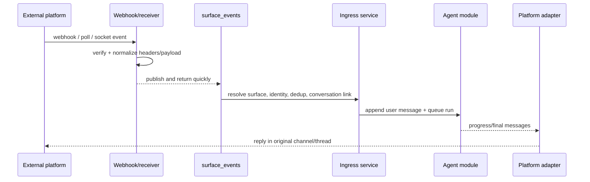

# Agent surfaces module

## Purpose

`app/modules/agent_surfaces` connects external messaging/email platforms to
pod-scoped agent conversations. It owns surface configuration, webhook/native
receiver ingress, signature verification, event normalization, external-user
identity resolution, thread-to-conversation links, attachment ingestion,
platform tools, progress rendering, and outbound delivery.

Supported adapters currently include Slack, Microsoft Teams, Telegram,
WhatsApp, Gmail, Outlook, and Resend-backed email behavior.

## Runtime contributions

| Contribution | Behavior |
| --- | --- |
| API routers | Pod surface CRUD/setup/catalog/send, current-user defaults, public webhooks/verification |
| Redis consumers | Surface webhooks, schedule fires, and pod deletion |
| streaq task | Execute one prepared surface message outside the webhook request |
| Worker lifespan | Optional Telegram polling and Slack Socket Mode receivers |
| API/worker cleanup | Close Redis event-dedup clients |

## Main data model

| Table | Meaning |
| --- | --- |
| `agent_surfaces` | Pod/platform/name, agent/account binding, routing, identity and send policy |
| `agent_surface_external_users` | Stable external identity to Lemma user/contact resolution |
| `agent_surface_conversation_links` | External channel/thread to agent conversation mapping |

Conversation metadata records surface, platform, external user/channel/thread,
and message identifiers so delivery and debugging do not depend only on the
link table.

## API groups

| Routes | What they do |
| --- | --- |
| `/pods/{pod_id}/surfaces` | CRUD surface installations and send a message |
| `/.../setup`, `/.../channels`, `/surface-setup`, `/available-surfaces` | Setup state/guides and platform/account catalog |
| `/surfaces/me` | List reachable user surfaces and choose a default |
| `/surfaces/webhooks/{platform}`, `/surfaces/{surface_id}/webhook` | Platform-wide or direct webhook ingest/verification |
| `/surfaces/teams/admin-consent/callback` | Teams tenant consent completion |

## Ingress and egress

Adapters share a contract for parse, enrich, sender profile, send, native
question/approval rendering (`send_questions`/`send_approval`), interaction
parsing, processing indicator, and platform tool construction. Attachments may
be downloaded, stored through datastore, transcribed, or referenced depending on
size/type. Email surfaces use subject/thread/address semantics rather than chat
streaming.

### Interactive tools and indicators

`ask_user` and `request_approval` pause the agent run (`WAITING`); the run
observer renders them on the surface and a submission resumes the run.

- **Native first, text fallback, never swallowed.** `ask_user` renders as native
  choices and `request_approval` as native **Approve / Deny** (optionally
  **Approve for session** when the paused call carries `permission_ids`) buttons
  on Slack (Block Kit), Teams (Adaptive Card `Action.Submit`), Telegram (inline
  keyboard), and WhatsApp (reply buttons). Any platform without native support —
  or a native render that fails — falls back to a formatted text prompt.
- **Decision routing.** A tapped approval button carries its decision back
  through `parse_inbound_interaction` → `ParsedSurfaceInteraction.approval_decision`
  (a canonical `AgentRunApprovalDecision` value) → `handle_interaction`, which
  resolves the paused run APPROVE_ONCE / DENY / APPROVE_FOR_SESSION. `ask_user`
  answers ride back keyed by question header. Both reuse replay-dedup and
  submitter-owns-conversation authorization.
- **Indicators.** WhatsApp marks the inbound message read (blue ticks) and shows
  a typing bubble via one Cloud API `status:read` + `typing_indicator` call.
  Telegram/Teams use a refreshed typing indicator; Slack streams a status line;
  WhatsApp/email have no per-step streaming.
- **Email is non-interactive.** On email surfaces `ask_user`/`request_approval`
  fail fast in-tool (returning an `interaction_fallback`) instead of pausing, so
  the run never strands in `WAITING`; the agent proceeds and delivers through the
  email reply tool.

### Routing, defaults, and history

- **Shared-bot surface selection.** When one system bot/number is reachable across
  pods in multiple orgs, `_select_surface` picks deterministically:
  pod membership → a valid saved default (`/surfaces/me`) which is **authoritative
  over conversation continuity** → continuity → oldest-tiebreak. A stale default
  (pointing at a pod the user left) is cleared and ignored.
- **DM reset window.** A DM starts a fresh Lemma conversation after
  `dm_conversation_reset_after_hours` of inactivity.
- **Runtime history window.** For surface conversations, prior history passed to
  the model is bounded by `surface_runtime_history_{max_messages,window_hours}`,
  trimmed at agent-run granularity so tool-call/return pairs stay intact.

## Authorization and security

Management routes use pod permissions and ensure connector account ownership.
Webhook security handles Slack signatures, Teams/Telegram/WhatsApp verification,
email provider metadata, timestamp windows, and challenge responses. Identity
policy controls whether unknown external senders are rejected, linked, or
represented as contacts. Redis dedup guards repeat provider deliveries.

## Tests and operations

The large unit/e2e matrix uses real payload fixtures and mock provider servers
for platform parsing, signatures, conversation reuse, identity, attachments,
approvals/forms, progress, and delivery. Current unit coverage is 65.8% (5,629
of 8,556 statements). Its legacy in-module README has stale route examples;
event-loss, complexity, and boundary findings are in [issues.md](issues.md).
