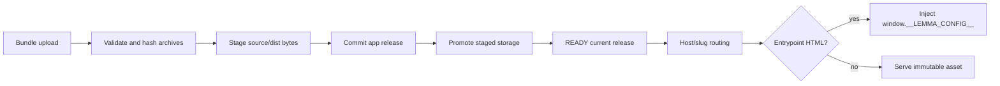

# Apps module

## Purpose

`app/modules/apps` hosts pod-specific operator applications. It owns app
metadata, versioned source/dist releases, bundle validation and storage,
authenticated pod asset access, public slug routing, browser SDK delivery, and
runtime configuration injection into HTML entrypoints.

## Runtime contributions

| Contribution | Behavior |
| --- | --- |
| Pod API router | App CRUD, widget-to-app creation, bundle upload, assets, source/dist archive download |
| Public app router | Resolve an app by host/slug and serve its built assets |
| Public SDK router | Serve `lemma-client.js`, legacy alias, and `lemma-ui.js` |
| Middleware | `AppHostRoutingMiddleware` maps app subdomains/hosts to public app routes |

There are no event consumers or worker tasks in this module. Builds performed
during pod-bundle import use AgentBox from the bundle module.

## Data and storage

| Table/storage | Meaning |
| --- | --- |
| `apps` | Pod/name, public slug, metadata, readiness/current release |
| `app_releases` | Immutable source/dist object keys, hashes, sizes, and release state |
| Object storage/local store | Source and distribution zip archives plus extracted assets |

## API groups

| Routes | What they do |
| --- | --- |
| `/pods/{pod_id}/apps` | Create/list/read/update/delete app records |
| `/.../apps/from-widget` | Promote a conversation widget into an app definition |
| `/.../apps/{name}/bundle` | Upload source and/or built distribution archives and finalize a release |
| `/.../assets...` | Serve an authenticated pod app asset |
| `/.../source/archive`, `/.../dist/archive` | Download stored release archives |
| `/public/apps...` | Host-based public app entrypoint/assets |
| `/public/sdk/*` | Browser SDK and web-component bundles |

## Release and serve flow

Storage uses a stage/commit/promote pattern with cleanup compensation. HTML
lint is advisory and reports obsolete SDK usage; it does not reject app code.
Entrypoints are no-cache and receive pod/API/auth context at serve time, while
hashed static assets use immutable caching and ETags.

## Authorization and security

Pod management/download routes use the normal pod context. Public apps are
intended to execute app-auth logic through the injected SDK; app origins are
separated by host routing. Path normalization and archive extraction prevent
asset traversal. Apps remain arbitrary user-authored HTML/JS, so isolation by
origin and response headers is part of the security boundary.

## Tests and operations

Tests cover lifecycle, host routing, public serving, storage compensation,
archive handling, HTML/SDK injection, CORS, and release deduplication. Current
unit coverage is 73.6% (732 of 994 statements). Multipart memory limits and
advisory-only validation are discussed in [issues.md](issues.md).
