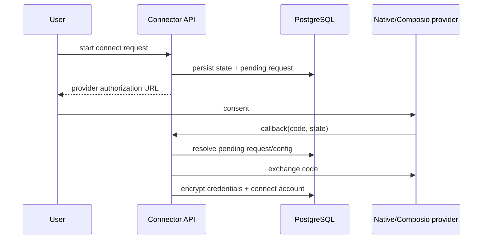

# Connectors module

## Purpose

`app/modules/connectors` manages third-party application capabilities. It owns
the connector/operation/trigger catalog, organization auth configurations,
user-owned connected accounts, OAuth/credential flows, operation discovery,
and operation execution routing between native Lemma integrations and Composio.

## Runtime contributions

The module contributes eight API routers and no event consumer or background
task. Long external operation calls use a resolve -> external call -> persist
saga so a pooled database connection is not held during provider I/O.

## Main data model

| Table | Meaning |
| --- | --- |
| `connectors` | Provider-independent application catalog entry |
| `connector_operations` | Searchable operation metadata and JSON input/output schemas |
| `connector_triggers` | Available external trigger metadata |
| `auth_configs` | Organization installation/configuration and encrypted OAuth client secrets |
| `accounts` | User-owned encrypted provider credentials and connection status |
| `connect_requests` | Short-lived OAuth state and authorization flow metadata |

## API groups

| Routes | What they do |
| --- | --- |
| `/connectors` | Public catalog, connector detail, and generated skill text |
| `/organizations/{org}/connectors/status` | Installed/connected capability summary |
| `/.../auth-configs` | Create/list/get/delete organization auth configurations |
| `/.../accounts` | Create/list/get/delete user accounts and resolve account credentials |
| `/.../connect-requests` + callback | Start OAuth and exchange callback state/code |
| `/.../{auth_config}/operations` | Search/details and execute an operation |
| `/.../{auth_config}/triggers` | Discover provider triggers |

## OAuth and execution flows

For execution, a short UoW resolves the auth config, operation, account, and
decrypted credential values into a session-free DTO. The provider call happens
outside a UoW; a final short UoW marks accounts for reauthentication when an
unauthorized response is classified.

## Authorization and secrets

- Auth configurations are organization-scoped; accounts remain owned by one
  user even when the auth configuration is shared.
- Credentials are encrypted by the shared versioned secret cipher.
- Operation execution resolves the caller's permitted account and scopes before
  calling a provider.
- Provider-specific capabilities live behind auth-provider and operation-gateway
  adapters.

## Tests and operations

Tests cover native and Composio routing, OAuth state, account identity,
credential encryption/refresh, catalog import, and operation timeouts. Current
unit coverage is 70.9% (2,237 of 3,155 statements). Error redaction,
credential-response, dynamic schema compilation, and oversized-service findings
are listed in [issues.md](issues.md).

