# Datastore module

## Purpose

`app/modules/datastore` gives each pod structured tables/records and a searchable
file tree. It manages dynamic PostgreSQL schemas, row-level authorization,
object storage, document-to-Markdown conversion, embeddings/search, signed
downloads, and live record-change streams.

Operator configuration for local, GCS, S3, and Azure storage is documented in
[Object storage](../operators/object-storage.md).

## Runtime contributions

| Contribution | Behavior |
| --- | --- |
| API routers | Table, record, SQL query, file, signed/public file, and WebSocket change APIs |
| Redis consumer | Queues file indexing from `datastore_events` |
| streaq tasks | Process files, clean deleted storage paths, recover stale processing rows |
| API lifespan | Backfills restricted query-role grants; closes datastore engine on app shutdown via core |
| Worker lifespan | Closes the reindex queue |

## Storage model

| Storage | Meaning |
| --- | --- |
| `datastore_tables` | Registry and JSON column schema for each logical table |
| Per-pod PostgreSQL schema | Physical record tables, constraints, indexes, and RLS policies |
| `datastore_files` | Hierarchical metadata, ownership, processing status, Markdown/index metadata |
| Object storage/local store | Original bytes, derived Markdown, images, and page renders |
| Search tables/indexes | Chunks and embeddings used by PostgreSQL search/reranking |

## API groups

| Routes | What they do |
| --- | --- |
| `/pods/{pod_id}/datastore/tables` | Create/list/get/update/delete tables and add/remove columns |
| `/.../tables/{table}/records` | CRUD, filter/sort/page, and bulk create/update/delete records |
| `/pods/{pod_id}/datastore/query` | Restricted ad-hoc datastore query under the RLS subject role |
| `/pods/{pod_id}/datastore/files` | Upload, folders, metadata/content update, Markdown attachment, tree, search, preview/download |
| `/public/datastore/files`, `/s/{code}` | Signed file delivery paths |
| `/pods/{pod_id}/datastore/changes` | Resumable WebSocket stream for authorized row changes |

## File lifecycle

```mermaid
stateDiagram-v2
    [*] --> PENDING: upload metadata + bytes
    PENDING --> PROCESSING: worker claims file
    PROCESSING --> READY: extract, chunk, index
    PROCESSING --> FAILED: retryable error
    FAILED --> PENDING: recovery retry
    PROCESSING --> FAILED_PERMANENT: retry budget exhausted
    READY --> PENDING: content/Markdown changes
    READY --> [*]: delete metadata; async byte/index cleanup
```

The worker can use Kreuzberg, MarkItDown, or Docling-compatible processing.
Large/parallel extraction is bounded by a semaphore and optional byte budget.
The recovery cron requeues stale `PENDING`/`PROCESSING` rows.
`DatastoreSettings` owns original, Markdown, attached-image, and request-batch
upload ceilings as well as document-processing controls.

## Authorization

- Table, record, and file services require a pod `Context` and apply role,
  resource-grant, visibility, ownership, and RLS rules.
- `/me` is a public alias for the current user's private file root; internal
  paths retain the user UUID.
- Signed URLs are purpose-bound, expire, and can have a Redis-enforced hit cap.
- The changes WebSocket filters emitted rows through the caller's visibility.

## Dependencies and consumers

Agents expose datastore/file tools; schedules consume record events; bundles
export/import schemas and seed data. The module uses identity/pod context and
publishes the shared `datastore_events` stream.

## Tests and operations

Tests cover schema/record validation, SQL safety, RLS, files, storage adapters,
document processing, recovery, signed URLs, WebSockets, and e2e CRUD. Current
unit coverage is 66.5% (4,316 of 6,487 statements); one MarkItDown unit test is
skipped when the optional package is absent. Upload-memory and event-reliability
findings are in [issues.md](issues.md).
