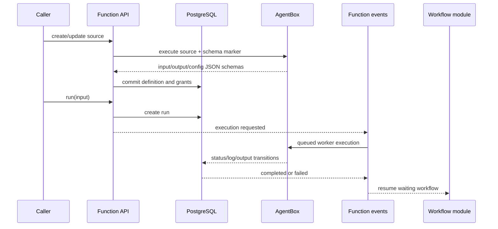

# Function module

## Purpose

`app/modules/function` owns deterministic Python functions stored with a pod.
It validates function source by extracting declared Pydantic schemas inside an
AgentBox session, manages function-level resource grants, queues executions,
persists logs/results, and publishes completion events used by workflows.

## Runtime contributions

| Contribution | Behavior |
| --- | --- |
| API router | Function CRUD, permission replacement, run creation/history/detail |
| Redis consumer | Projects function run events into persistence and queues execution |
| streaq task | `process_function_run` executes queued runs in AgentBox |
| Published stream | Function execution-requested, started, logs, completed, and failed events |

## Main data model

| Table | Meaning |
| --- | --- |
| `functions` | Pod/name, source metadata, input/output/config schemas, visibility |
| `function_runs` | Input, output, logs/error, status, user, workspace session/process ids, job id |

Function source files are stored outside the database through
`FunctionFileManager`; the table keeps the definition and derived schemas.

## API groups

| Routes | What they do |
| --- | --- |
| `/pods/{pod_id}/functions` | Create and list function definitions |
| `/.../functions/{name}` | Get/update/delete a function |
| `/.../functions/{name}/permissions` | Read/replace named resource grants |
| `/.../functions/{name}/runs` | Start a synchronous/queued run and list history |
| `/.../runs/{run_id}` | Inspect status, output, logs, and failure information |

## Definition and execution flows

The executor deliberately uses multiple short UoWs. It releases the connection
before sandbox creation/execution, then opens fresh scopes for status and
terminal writes. Synchronous runs only retry when the request provably did not
reach AgentBox; ambiguous transport errors are not replayed because functions
may have side effects.

## Authorization and isolation

- Definition CRUD and execution require pod permissions.
- A named function runs as a delegated workload with only its explicit resource
  grants/scopes; source executes inside AgentBox, not in the API process.
- Function calls made by an agent can preserve the invoking agent workload
  identity rather than silently gaining the function owner's authority.

## Tests and operations

Tests cover schemas, file management, event projection, permission revocation,
timeouts, retries, cancellation, AgentBox execution, and workflow completion
events. Current unit coverage is 61.4% (989 of 1,611 statements). See
[issues.md](issues.md) for coverage and boundary findings.
