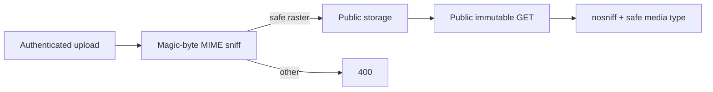

# Icon module

## Purpose

`app/modules/icon` is a small shared media service for user-uploaded resource
icons. It accepts authenticated uploads, verifies actual bytes are an inert
raster format, stores them in public local/GCS storage, returns a stable URL,
and serves the bytes with MIME-sniffing protection and immutable caching.

## Runtime contributions and API

| Route | Behavior |
| --- | --- |
| `POST /icons/upload` | Read an uploaded image, sniff its magic bytes, store under `icons/{user_id}/{uuid}.{ext}`, return URL/path/type |
| `GET /public/icons/{icon_path}` | Normalize path, read bytes, serve safe raster types inline and legacy/unknown types as attachments |

The module contributes no tables, events, or workers. `IconService.delete_by_url`
lets owner modules clean up a previously managed icon when replacing/deleting a
resource.

## Security boundary

Only PNG, JPEG, GIF, WebP, and BMP magic bytes are accepted. SVG is rejected
because the public route shares a cookie-bearing API origin. Retrieval sets
`X-Content-Type-Options: nosniff`; an unknown/legacy extension is
`application/octet-stream` with `Content-Disposition: attachment`. Storage path
normalization rejects empty, dot, and parent segments. `IconSettings` owns the
5 MiB upload, 4,096-pixel dimension, and total-pixel limits.

## Tests and operations

Tests cover upload limits and validation, public retrieval, traversal rejection,
headers, and cleanup. See [issues.md](issues.md) for the resolved upload finding.
