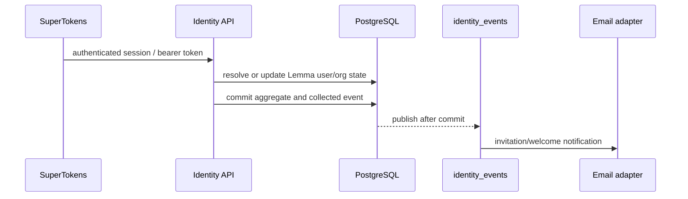

# Identity module

## Purpose

`app/modules/identity` owns a person's Lemma identity and organization-level
tenancy. It integrates SuperTokens authentication with Lemma user rows, manages
organizations/members/invitations, and emits email-oriented identity events.
Pod membership is deliberately owned by the [pod module](pod.md).

## Runtime contributions

| Contribution | Behavior |
| --- | --- |
| API routers | `/users`, `/organizations`, `/auth` |
| Redis consumer | Sends invitation, welcome, and invitation-accepted emails from identity events |
| API lifespan | Closes the Redis-backed user cache |
| External systems | SuperTokens and SMTP/email adapter |

## Main data model

| Table | Meaning |
| --- | --- |
| `users` | Lemma profile keyed to the SuperTokens user id |
| `organizations` | Organization name, slug, policy, and owner context |
| `organization_members` | User membership and organization role |
| `organization_invitations` | Pending/accepted invitation lifecycle |

Organization roles are `ORG_OWNER`, `ORG_EDITOR`, and `ORG_MEMBER`. Pod roles
are a different authorization layer.

## API groups

| Routes | What they do |
| --- | --- |
| `GET/POST /users/me...` | Read current user/profile and upsert profile preferences |
| `/organizations` | Create and list organizations, suggestions, slug availability, and auto-join |
| `/organizations/{org_id}` | Read/update organization and manage members/invitations |
| `/organizations/invitations...` | Inspect, accept, and revoke invitations |
| `/auth/verify-token` | Resolve bearer/delegation claims into user, pod, organization, function, and scope context |
| `/auth/cli/*` | Publish CLI login metadata, mint a CLI session from a browser session, and refresh CLI tokens |

## Key flows

SuperTokens initialization and recipe overrides synchronize authentication
events with Lemma profiles. The CLI endpoints mint a separate session so a CLI
can rotate access/refresh tokens without borrowing browser cookies.

## Authorization and security

- `CurrentUser`/`request.state.user` is populated by the global auth middleware.
- Organization services require membership and enforce owner/editor/member
  operations; email events carry only notification data.
- The module provides identity repositories/ports used by pod, connectors,
  surfaces, usage, and workspace.
- CLI refresh is intentionally callable without a current access token; the
  refresh token is the credential.

## Tests and operations

Unit and e2e tests cover organization lifecycle, SuperTokens configuration,
profile behavior, and invitation flows. Current unit coverage is 60.6% (995 of
1,642 statements). Security-sensitive gaps and secret-handling findings are in
[issues.md](issues.md).

