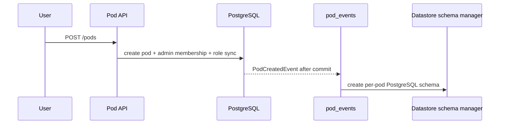

# Pod module

## Purpose

`app/modules/pod` is the tenant boundary for team work. It owns pod lifecycle,
pod membership, pod roles, join requests, the permission catalog exposed to
clients, and resource-level grants for users, roles, and workloads.

## Runtime contributions

| Contribution | Behavior |
| --- | --- |
| API routers | Pods, members, roles, effective permissions, join requests, resource access |
| Redis consumers | Provision a pod datastore schema after creation; notify admins of join requests |
| Published stream | `pod_events` for create/member/delete/join lifecycle |

## Main data model

| Table/state | Meaning |
| --- | --- |
| `pods` | Organization-owned workspace, typed `PodConfig`, visibility/deletion state |
| `pod_members` | Organization member to pod mapping plus assigned pod-role names |
| `pod_join_requests` | Pending/approved access requests |
| Core authorization tables | Role permission bundles and named resource/workload grants |

Built-in pod roles are normalized in `domain/roles.py`; custom roles and their
permission bundles use the shared authorization repositories.

## API groups

| Routes | What they do |
| --- | --- |
| `/pods` and `/pods/{pod_id}` | Create/read/update/soft-delete pods and list by organization |
| `/pods/{pod_id}/members` | Add, find, list, re-role, and remove members |
| `/pods/{pod_id}/roles` | CRUD custom roles and replace their permission bundles |
| `/pods/{pod_id}/permissions/*` | Permission catalog and current user's effective permissions |
| `/pods/{pod_id}/resources/.../access` | Read/replace/delete a grantee's resource grant |
| `/pods/{pod_id}/join*` | Direct policy-based join and reviewable join requests |

## Key flows

Pod deletion is a soft delete followed by events consumed by dependent modules
to clean up schedules and surfaces. Resource authorization is grant-first for
named workloads; the default pod agent mirrors its invoking user's rights.
Destructive operations additionally require standing authority or a session
approval.

## Dependencies

The module uses identity's organization/user models and the icon service. It is
consumed by nearly every pod-scoped module. Datastore provisioning is event
driven to keep pod creation fast, which makes reliable event handling a
load-bearing invariant.

## Tests and operations

Tests cover CRUD, custom roles, join policy, resource grants, authorization
hardening, delegation, and event behavior. Current unit coverage is 62.0%
(1,062 of 1,714 statements). See [issues.md](issues.md) for provisioning and
module-coupling findings.

