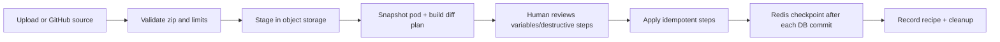

# Pod bundle module

## Purpose

`app/modules/pod_bundle` exports a pod as a portable bundle, plans the diff for
an uploaded/GitHub bundle, applies an approved plan step by step, and publishes
a bundle to GitHub through a connected account. Format primitives are shared
with the CLI through the top-level `lemma-pod-bundle` package.

## Runtime contributions

| Contribution | Behavior |
| --- | --- |
| API routers | Import/upload/plan/apply/replan/cancel/events, export/status/download, publish/status/events |
| streaq tasks | Export, plan URL/GitHub import, apply, GitHub publish |
| cron | Sweep expired staging objects and mark stuck states |
| Realtime | Redis pub/sub SSE plus polling snapshots |

The module deliberately owns no SQL tables. Active job state is a typed Redis
document with a refreshed TTL; zip archives are staged in object storage.
Completed import provenance is appended to `PodConfig.recipes`.

## Job state

| Job | Typical states |
| --- | --- |
| Export | `QUEUED -> EXPORTING -> READY` or `FAILED`; ready state includes signed download URL |
| Import | `QUEUED/FETCHING -> PLANNING -> AWAITING_CONFIRMATION -> APPLYING -> COMPLETED` or `FAILED/CANCELLED` |
| Publish | `QUEUED -> EXPORTING/UPLOADING -> COMPLETED` or `FAILED` |

## API groups

| Routes | What they do |
| --- | --- |
| `/pods/{pod_id}/bundle/uploads` | Stage a local zip and mint a signed Lemma URL |
| `/.../bundle/imports` | Start URL/GitHub planning, poll, replan, approve apply, cancel, or stream SSE |
| `/.../bundle/exports` | Start/poll an export; authenticated signed-token download is `/pods/bundle/download` |
| `/.../bundle/publishes` | Start/poll/stream GitHub publication |

## Import flow

Every non-app apply step opens its own authorization/UoW scope and commits
before the Redis `DONE` checkpoint. App steps self-scope around an AgentBox
build. A crash between commit and checkpoint replays an idempotent upsert. The
format handles tables/data, files, functions, agents/grants/toolsets, workflows,
schedules, apps/source, surfaces/account variables, and pod metadata.

## Security and limits

Archive extraction is zip-slip and zip-bomb guarded. Import requires pod update;
export/publish require pod read plus account ownership where applicable.
Destructive table changes require explicit confirmation. Configurable per-item,
record, data, app, archive, and uncompressed-byte caps bound work, and a Redis
daily limiter bounds starts. Download URLs are purpose-signed and require a
logged-in user in addition to the token.

## Tests and operations

Unit/e2e tests cover format/diff, staging, limits, plan/apply idempotency,
variables, executable imported resources, apps, surfaces, GitHub import/publish,
SSE, expiry, and cleanup. Current unit coverage is 70.4% (1,977 of 2,807
statements). Cancellation concurrency and request-buffering findings are in
[issues.md](issues.md). The deeper design rationale remains in
[pod-bundle-share-import.md](../../../docs/design/pod-bundle-share-import.md).
