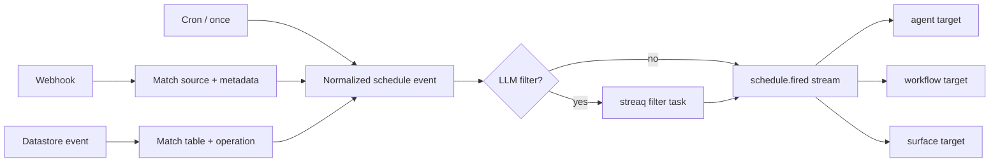

# Schedule module

## Purpose

`app/modules/schedule` turns time, webhooks, datastore changes, and application
events into normalized `schedule.fired` events. Targets are agents, workflows,
or surfaces; target modules decide how to execute the fire.

## Runtime contributions

| Contribution | Behavior |
| --- | --- |
| API routers | Pod schedule CRUD and public webhook ingress/verification |
| Redis consumers | Schedule commands, datastore events, pod deletion, scheduler notifications |
| streaq task | Evaluate LLM filters off-request |
| Scheduler process | APScheduler service and internal `/scheduler/jobs` control API |
| Published stream | `schedule_events` |

## Data and schedule types

`schedules` stores target, active state, type-specific config, optional filter
instruction/schema, and external scheduler metadata. Supported logical types
include time/cron or once, webhook, datastore, and application-triggered
schedules. APScheduler owns the concrete time job store.

## API groups

| Routes | What they do |
| --- | --- |
| `/pods/{pod_id}/schedules` | Create/list/get/update/delete logical schedules |
| `POST /webhooks/{source}` | Validate/map a provider payload, match schedules, and publish or enqueue filtering |
| `GET /webhooks/{source}/verify` | Provider challenge/verification path |
| `/scheduler/jobs...` | Internal create/list/status/pause/resume/delete operations used by the scheduler client |

## Fire flow

The service mirrors logical changes into the external scheduler through an
adapter. A Redis fire store deduplicates agent-target fires and counts
consecutive failures for automatic deactivation; workflow targets additionally
use a database uniqueness key.

## Authorization and security

Schedule CRUD is pod-authorized. Webhook ingress is public by necessity and
uses source-specific verification adapters plus schedule matching. Deletion of
a pod is consumed as a system event to tear down schedules and external jobs.

## Tests and operations

Tests cover normalization, filters, adapters, CRUD, scheduler calls, and event
consumers. Current unit coverage is the lowest installed module at 54.2%
(1,049 of 1,935 statements). Duplicate-fire and silent-filter-failure risks are
tracked in [issues.md](issues.md).
