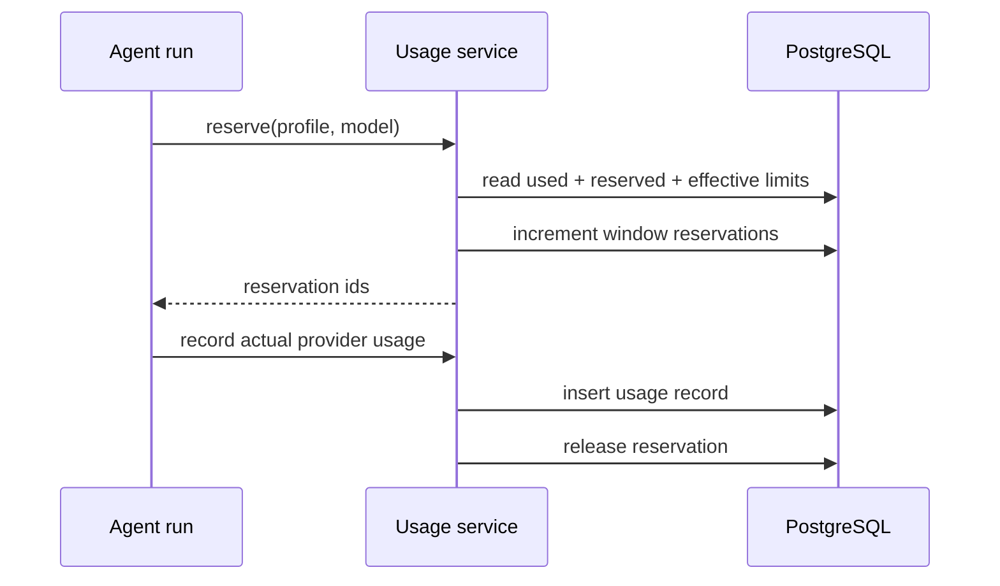

# Usage module

## Purpose

`app/modules/usage` meters model work, calculates system-provider cost,
reserves budget before a run, records final usage, exposes organization/user
reports, and provides an extension port for cloud billing/plan limits.

## Runtime contributions

| Contribution | Behavior |
| --- | --- |
| API router | Organization summaries/events/stats/limits and current-user usage |
| Redis router | Registered but currently contains no subscribers |
| API lifespan | Checks configured system model names have pricing and logs uncovered entries |
| Domain events | Usage-recorded and limit-denied events are collected with the UoW |

## Main data model

| Table | Meaning |
| --- | --- |
| `usage_records` | Immutable run/profile/model/token/unit/cost/status attribution |
| `usage_limit_counters` | Per organization/user time-window reserved amount used to constrain concurrency |

System-scoped runtimes use registered per-model pricing; an intentionally
conservative fallback prevents unknown models from becoming free. User-owned
provider profiles are recorded but do not count as Lemma system cost.

## API groups

All routes are under `/usage/organizations/{organization_id}`: aggregate
summary, paginated events, time-bucketed/grouped stats, effective limits, and
the current user's view. Access is organization-membership/role scoped.

## Reservation and recording flow

`UsageLimitPort` lets another composed module supply plan-specific values. The
OSS fallback currently applies default organization-month and user-week limits
to system-scoped model usage.

## Tests and operations

Tests cover pricing, reservations, fallback pricing, limits, queries, and API
authorization. Current unit coverage is 64.7% (542 of 838 statements). Atomic
limit-enforcement and low test-file-count findings are in
[issues.md](issues.md).

