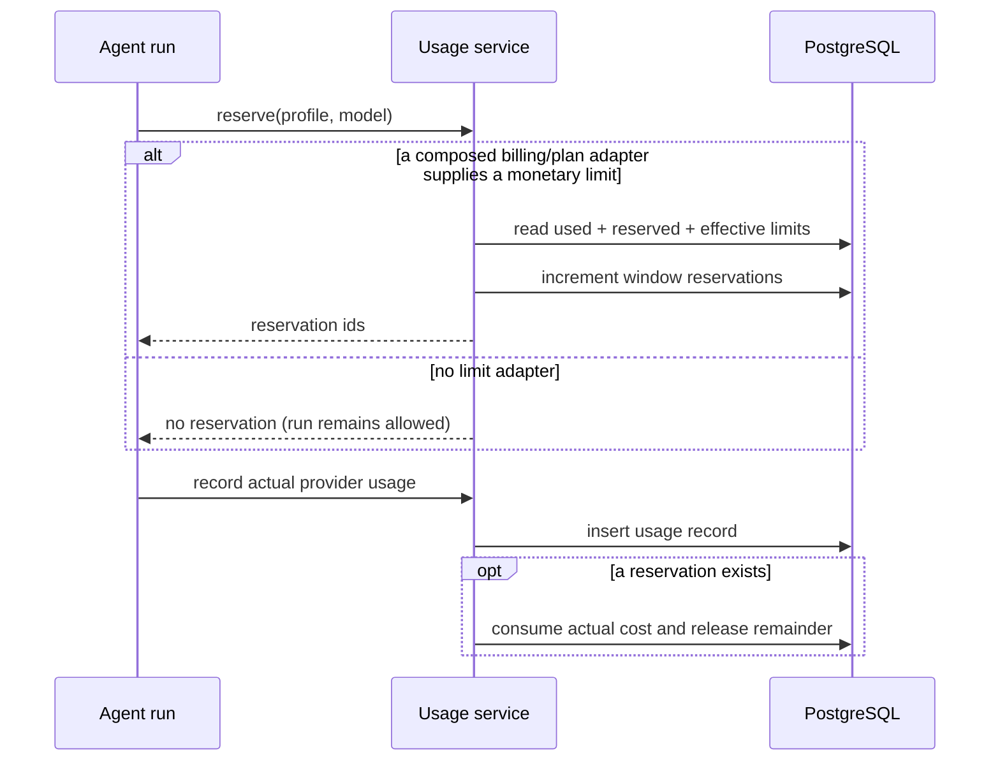

# Usage module

## Purpose

`app/modules/usage` meters model work, calculates system-provider cost,
optionally reserves budget before a run, records final usage, exposes
organization/user reports, and provides an extension port for billing/plan
limits.

## Runtime contributions

| Contribution | Behavior |
| --- | --- |
| API router | Organization summaries/events/stats/limits and current-user usage |
| Domain events | Usage-recorded and limit-denied events are collected with the UoW |

## Main data model

| Table | Meaning |
| --- | --- |
| `usage_records` | Immutable run/profile/model/token/unit/cost/status attribution |
| `usage_limit_counters` | Per organization/user time-window reserved amount used to constrain concurrency |

System-scoped runtimes use registered per-model pricing when available. An
unknown model is still metered, but its record has `cost_usd = null` and
`metadata.pricing_missing = true`; missing pricing never blocks the run.
User-owned provider profiles are recorded but do not count as Lemma system
cost.

## API groups

All routes are under `/usage/organizations/{organization_id}`: aggregate
summary, paginated events, time-bucketed/grouped stats, effective limits, and
the current user's view. Access is organization-membership/role scoped.

## Reservation and recording flow

`UsageLimitPort` lets another composed module supply plan-specific values. The
OSS/local default is unlimited so an unregistered custom model cannot prevent
an agent run. OSS does not define environment-backed plans or a fail-closed
pricing policy; deployments that need monetary admission install a
`UsageLimitPort` and register the prices they want reflected in usage records.
Direct model-call token/request guardrails are independent of monetary
admission.

## Tests and operations

Tests cover optional pricing, unlimited defaults, injected reservations,
atomic counter concurrency, queries, and API authorization. Issue evidence is in
[issues.md](issues.md).
