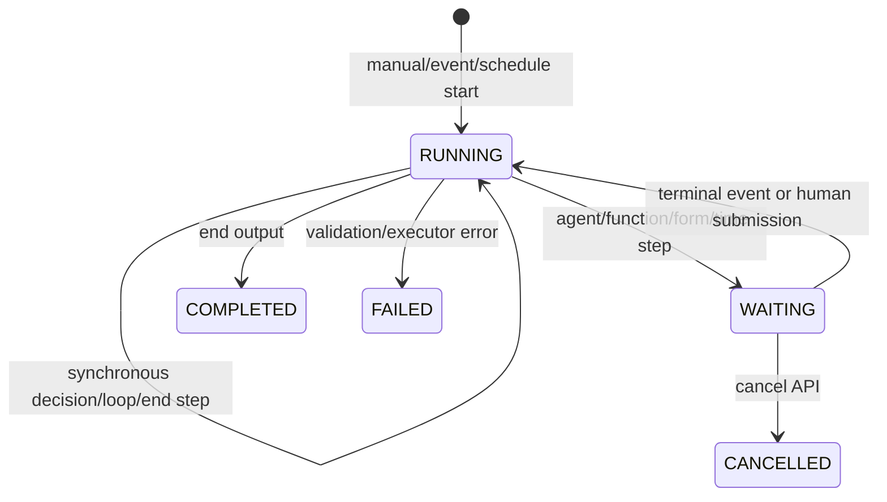

# Workflow module

## Purpose

`app/modules/workflow` defines and executes directed workflow graphs. A graph
can combine functions, agents, decisions, loops, waits, human forms, and end
nodes. The module persists run context and step history, pauses on external
work, and resumes from function, agent, schedule, or user-form events.

## Runtime contributions

| Contribution | Behavior |
| --- | --- |
| API routers | Workflow CRUD/graph/visualization, run create/list/detail/cancel/form/visualization |
| Redis consumers | Function completion, agent completion, and schedule-fired events |
| streaq tasks | Resume function/agent waits and start scheduled workflows |
| cron | Reconcile stale waits every five minutes |

## Main data model

| Table | Meaning |
| --- | --- |
| `workflow_flows` | Named pod graph, typed start configuration, visibility |
| `workflow_flow_runs` | Status, trigger/run context, step records, output/error |
| `workflow_run_waits` | Active/completed external or human wait assignment and payload |

## Graph vocabulary

| Node | Behavior |
| --- | --- |
| Function | Starts a function run and waits for its terminal event |
| Agent | Starts/continues an agent conversation and waits for completion |
| Decision | Evaluates ordered expressions and chooses an edge |
| Loop | Iterates items while maintaining a scoped loop frame |
| Form | Persists a human wait with schema/assignment and resumes on submission |
| Wait until | Pauses until a time/schedule signal |
| End | Resolves output bindings and completes the run |

## API groups

`/pods/{pod_id}/workflows` provides CRUD, graph replacement, manual run
creation, run history, and definition visualization. `/pods/{pod_id}/workflow-runs`
provides assigned waits, form submission, cancellation, detail, and run
visualization.

## Execution flow

`WorkflowEngine` loads a run and graph; `WorkflowStepper` selects the current
node and delegates to a typed executor. Input/output bindings use literals or
expressions over the run context. External executors create durable waits before
returning. Event consumers enqueue idempotently named resume jobs, and the cron
reconciles completion events that were missed.

## Authorization and dependencies

Workflow definition/run operations use pod permissions and resource grants.
Human form assignment resolves pod members. Adapter ports invoke agent,
function, and schedule modules. Scheduled start configuration imports schedule
value types directly, while schedule also calls workflow services; this cycle is
tracked in [issues.md](issues.md).

## Tests and operations

Tests cover graph validation, expressions, every node executor, waits/forms,
resumption, cancellation, authorization, visualization, schedules, and e2e
function/agent execution. Current unit coverage is 67.6% (1,618 of 2,393
statements). Event-ack reliability remains a review finding.

