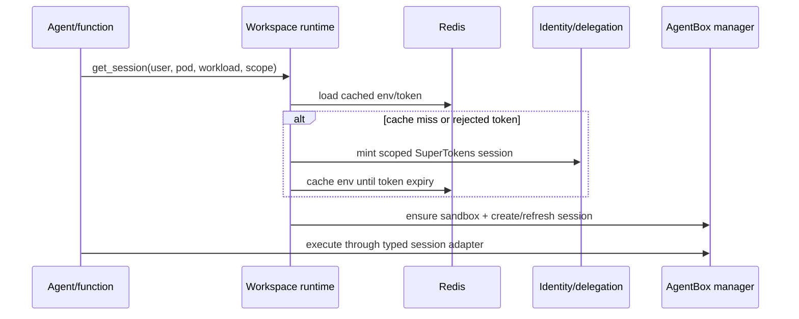

# Workspace module

## Purpose

`app/modules/workspace` adapts the backend to AgentBox. It creates/reuses a
user sandbox, creates workload sessions, injects scoped Lemma credentials and
pod context, executes Python/shell/process commands, manages process/session
lookups, and creates short-lived browser-app access URLs.

## Runtime contributions

| Contribution | Behavior |
| --- | --- |
| `GET /workspace/me` | Report current user's sandbox, sessions, and exposed apps |
| `POST /workspace/apps/browser/access` | Ensure browser runtime and return an authenticated access URL |
| Service/tool surface | Used internally by agents, functions, and pod-bundle app builds |

The module owns no database tables or message consumer. AgentBox is the source
of truth for sandbox/session/process lifecycle; Redis caches activity, state,
process bindings, and reusable environment values.

## Main components

| Component | Responsibility |
| --- | --- |
| `WorkspaceSandboxService` | Sandbox ensure/status/delete, env creation, session construction |
| `AgentBoxWorkspaceSession` | Typed execute Python/command, stdin, list/terminate process, heartbeat |
| `WorkspaceToolRuntime` | Lazy session acquisition, delegated-token env cache, process bindings |
| `WorkspaceFileManager` | File-oriented helpers implemented through commands inside a session |
| State/activity stores | Redis-backed status, locking, idle/activity metadata |

## Session flow

The same AgentBox manager API selects Docker/Podman locally or Kubernetes in
cloud. The backend never manages those runtimes directly. Sandbox calls have
bounded retry/recovery rules; non-idempotent function execution is not replayed
after ambiguous failures.

## Authorization and security

Sessions receive `LEMMA_TOKEN`, API/auth/host URLs, user/pod/org ids, and a
working directory. When delegated authorization is enabled, tokens include
workload id/type/name, pod, session, invoker, and narrowed scopes. Browser
access is minted by AgentBox and returned only to the authenticated user.

## Tests and operations

Tests cover retry boundaries, fake AgentBox behavior, browser access, session
lifecycle, cache expiry/invalidation, process bindings, and real Docker runtime
smoke paths. Current unit coverage is 67.2% (845 of 1,257 statements). Plaintext
token caching and module-boundary findings are in [issues.md](issues.md).

